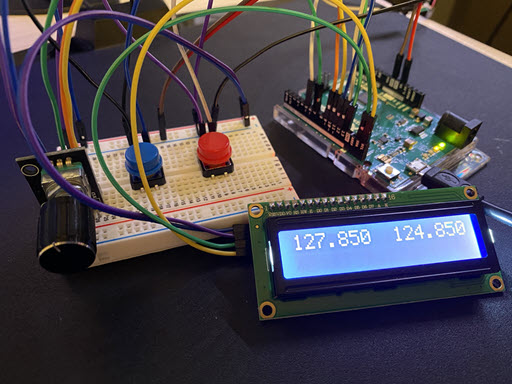
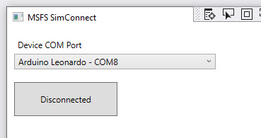

# Microsoft Flight Sim Arduino Radio Controller

A simple arduino based controller for Microsoft Flight Simulator 2020 (MSFS) to control the COM1 radio frequencies. 

There are two parts to the project:

* Arduino controller project 
* Windows based connector app

### Arduino controller project

For this you will need:

* Arduino controller e.g. Arduino Leonardo
* I2C LCD screen
* Rotary encoder
* Button x2
* Breadboard
* Various wires



### Windows connector app

This project includes the code needed to run a small app that takes commands from the arduino controller and communicates with MSFS 2020.  It communicates with the Arduino over a COM port and communicates with MSFS using the SimConnect API that Microsoft provides.

## Getting started

### Building the arduino controller

If you have done some arduino things before you can get started by wiring up 2 buttons to input pins + ground, connecting your I2C LCD to the SCL/SDA pins + 5V and ground and the rotary encoders 3 (or 5 if it has a button) pins to digital pins.

If you haven't done this before. I am hoping to record a video soon with step by step instructions :)

### Deploying the arduino code 

You will need to have your Arduino all set up and ready to go with the [Arduino IDE](https://www.arduino.cc/en/Guide).

The arduino sketch you need to load is in the [arduino controller](src/ArduinoController) folder.

In [ArdunioController.ino](ArdunioController.ino) You will need to update the following defines to the pins that you connected your buttons and encoder to:

```
#define ROTARY_PIN1	9           // DT pin on rotary encoder
#define ROTARY_PIN2	10          // CLK pin on rotary encoder
#define BUTTON_PIN	7           // SW pin on rotary encoder
#define CLICKS_PER_STEP   4     // number of steps for each "notch" on your rotary encoder 
#define XFER_BUTTON_PIN  12     // button A pin - transfer from standby to active frequency
#define MINOR_BUTTON_PIN  11    // button B pin - switch between tuning the whole part of the freq e.g. 123 and the fractional part e.g. .750
```

### Building and starting the Windows app

You will need Visual Studio to build and run the app. When your run it, it should detect the COM ports you have things connected to and you should see your arduino like this.



### Putting it all together

After you have deployed the arduino project and built the windows application you are ready to start using it!

* Start MSFS and wait for it to load
* Power up your Arduino
* Start the windows app 
* Select the correct COM port the arduino is on
* Click Connect to connect to MSFS and the arduino

If everything goes well you should be able to:

* Click button A to switch the standby and active frequencies for COM1
* Dial the rotary encoder to change the standby frequency
* Click button B to flip between changing the major part or the minor part of the standby frequency

